# Documentação Técnica do Sistema

**Versão:** 1.1  
**Data:** Janeiro 2026 (Atualizado: 02/01/2026)
**Tecnologias:** React 18, TypeScript, Vite, Tailwind CSS, Supabase, TanStack Query

---

## Índice

1. [Arquitetura de Módulos](#1-arquitetura-de-módulos)
2. [Modelos de Dados](#2-modelos-de-dados)
3. [Fluxos e Regras de Negócio](#3-fluxos-e-regras-de-negócio)
4. [Controles de Acesso](#4-controles-de-acesso)
5. [Integrações e Automações](#5-integrações-e-automações)
6. [Pontos de Interação do Usuário](#6-pontos-de-interação-do-usuário)

---

## 1. Arquitetura de Módulos

### 1.1 Visão Geral dos Módulos

O sistema está organizado em módulos funcionais, cada um responsável por um domínio específico do negócio imobiliário.

| Categoria | Módulo | Descrição | Arquivo Principal |
|-----------|--------|-----------|-------------------|
| **Dashboard** | Operacional | KPIs operacionais e métricas de vendas | `src/pages/Index.tsx` |
| **Dashboard** | Executivo | Visão estratégica para gestores | `src/pages/DashboardExecutivo.tsx` |
| **Empreendimentos** | Gestão de Empreendimentos | CRUD de empreendimentos, blocos, tipologias | `src/pages/Empreendimentos.tsx` |
| **Empreendimentos** | Mapa de Unidades | Visualização interativa de plantas | `src/pages/MapaUnidadesPage.tsx` |
| **Clientes** | Cadastro de Clientes | Gestão de clientes e leads | `src/pages/Clientes.tsx` |
| **Clientes** | Atividades | Follow-ups e interações | `src/pages/Atividades.tsx` |
| **Comercial** | Negociações | Pipeline de vendas (Kanban) | `src/pages/Negociacoes.tsx` |
| **Comercial** | Solicitações | Fila de aprovação de reservas (Gatekeeper) | `src/pages/Solicitacoes.tsx` |
| **Comercial** | Metas Comerciais | Definição e acompanhamento de metas | `src/pages/MetasComerciais.tsx` |
| **Comercial** | Forecast | Previsão de vendas | `src/pages/Forecast.tsx` |
| **Contratos** | Gestão de Contratos | Geração e aprovação de contratos | `src/pages/Contratos.tsx` |
| **Financeiro** | Fluxo de Caixa | Lançamentos financeiros | `src/pages/Financeiro.tsx` |
| **Financeiro** | DRE | Demonstrativo de resultados | `src/pages/DRE.tsx` |
| **Financeiro** | Comissões | Gestão de comissões de vendas | `src/pages/Comissoes.tsx` |
| **Financeiro** | Bonificações | Bonificações por meta | `src/pages/Bonificacoes.tsx` |
| **Parceiros** | Imobiliárias | Cadastro de imobiliárias parceiras | `src/pages/Imobiliarias.tsx` |
| **Parceiros** | Corretores | Cadastro de corretores | `src/pages/Corretores.tsx` |
| **Marketing** | Tickets | Gestão de demandas de marketing | `src/pages/Marketing.tsx` |
| **Marketing** | Calendário | Visualização de entregas | `src/pages/MarketingCalendario.tsx` |
| **Marketing** | Briefings | Solicitações de materiais | `src/pages/Briefings.tsx` |
| **Eventos** | Gestão de Eventos | Planejamento de eventos | `src/pages/Eventos.tsx` |
| **Eventos** | Calendário | Visualização de eventos | `src/pages/EventosCalendario.tsx` |
| **Sistema** | Usuários | Gestão de usuários e permissões | `src/pages/Usuarios.tsx` |
| **Sistema** | Auditoria | Logs de alterações | `src/pages/Auditoria.tsx` |
| **Sistema** | Configurações | Configurações do sistema | `src/pages/Configuracoes.tsx` |

### 1.2 Entidades Principais por Módulo

#### Dashboard
- **Estatísticas Agregadas**: Consultas em tempo real de múltiplas tabelas
- **Hooks**: `useDashboardIncorporador`, `useDashboardExecutivo`

#### Empreendimentos
| Entidade | Tabela | Descrição |
|----------|--------|-----------|
| Empreendimento | `empreendimentos` | Projeto imobiliário |
| Bloco | `blocos` | Torres/blocos do empreendimento |
| Tipologia | `tipologias` | Tipos de unidades (2Q, 3Q, etc.) |
| Unidade | `unidades` | Apartamentos/casas individuais |
| Documento | `empreendimento_documentos` | Documentos do empreendimento |
| Mídia | `empreendimento_midias` | Imagens e vídeos |
| Mapa | `empreendimento_mapas` | Plantas interativas |

#### Clientes
| Entidade | Tabela | Descrição |
|----------|--------|-----------|
| Cliente | `clientes` | Cadastro de clientes/leads |
| Interação | `cliente_interacoes` | Histórico de contatos |
| Atividade | `atividades` | Tarefas e follow-ups |

#### Comercial
| Entidade | Tabela | Descrição |
|----------|--------|-----------|
| Negociação | `negociacoes` | Pipeline de vendas |
| Unidade da Negociação | `negociacao_unidades` | Carrinho de unidades (multi-item) |
| Histórico | `negociacao_historico` | Histórico de movimentações |
| Funil | `funis` | Configuração de funis de venda |
| Etapa do Funil | `funil_etapas` | Etapas do pipeline |
| Reserva | `reservas` | Reservas de unidades |
| Meta Comercial | `metas_comerciais` | Metas por período |

#### Contratos
| Entidade | Tabela | Descrição |
|----------|--------|-----------|
| Contrato | `contratos` | Contratos de compra e venda |
| Template | `contrato_templates` | Modelos de contrato |
| Variável | `contrato_variaveis` | Variáveis para templates |
| Signatário | `contrato_signatarios` | Assinantes do contrato |
| Documento | `contrato_documentos` | Documentos anexos |
| Pendência | `contrato_pendencias` | Pendências contratuais |
| Versão | `contrato_versoes` | Histórico de versões |
| Aprovação | `contrato_aprovacoes` | Fluxo de aprovação |
| Condição de Pagamento | `contrato_condicoes_pagamento` | Forma de pagamento |

#### Financeiro
| Entidade | Tabela | Descrição |
|----------|--------|-----------|
| Lançamento | `lancamentos_financeiros` | Receitas e despesas |
| Comissão | `comissoes` | Comissões de vendas |
| Parcela de Comissão | `comissao_parcelas` | Parcelas de pagamento |
| Bonificação | `bonificacoes` | Bonificações por meta |
| Categoria | `categorias_fluxo` | Categorias de lançamentos |
| Centro de Custo | `centros_custo` | Centros de custo |
| Tipo de Parcela | `tipos_parcela` | Tipos de parcelas (sinal, entrada, etc.) |

#### Parceiros
| Entidade | Tabela | Descrição |
|----------|--------|-----------|
| Imobiliária | `imobiliarias` | Imobiliárias parceiras |
| Corretor | `corretores` | Corretores vinculados |
| Vínculo Empreendimento | `empreendimento_corretores` | Autorização por empreendimento |
| Vínculo Imobiliária | `empreendimento_imobiliarias` | Autorização por empreendimento |

#### Marketing
| Entidade | Tabela | Descrição |
|----------|--------|-----------|
| Ticket | `tickets` | Demandas de marketing |
| Tarefa | `ticket_tarefas` | Subtarefas do ticket |
| Comentário | `ticket_comentarios` | Comunicação no ticket |
| Etapa | `ticket_etapas` | Configuração do Kanban |
| Briefing | `briefings` | Solicitações formais |

#### Eventos
| Entidade | Tabela | Descrição |
|----------|--------|-----------|
| Evento | `eventos` | Eventos programados |
| Tarefa | `evento_tarefas` | Tarefas do evento |
| Membro Equipe | `evento_equipe` | Equipe do evento |
| Template | `evento_templates` | Modelos de eventos |

#### Sistema
| Entidade | Tabela | Descrição |
|----------|--------|-----------|
| Perfil | `profiles` | Perfis de usuários |
| Role | `roles` | Papéis/cargos |
| Vínculo Usuário-Role | `user_roles` | Atribuição de papéis |
| Módulo | `modules` | Módulos do sistema |
| Permissão | `role_permissions` | Permissões por papel |
| Vínculo Usuário-Empreendimento | `user_empreendimentos` | Acesso a empreendimentos |
| Log de Auditoria | `audit_logs` | Registro de alterações |
| Configuração | `configuracoes_sistema` | Configurações gerais |
| Webhook | `webhooks` | Integrações externas |

### 1.3 Diagrama de Dependências entre Módulos

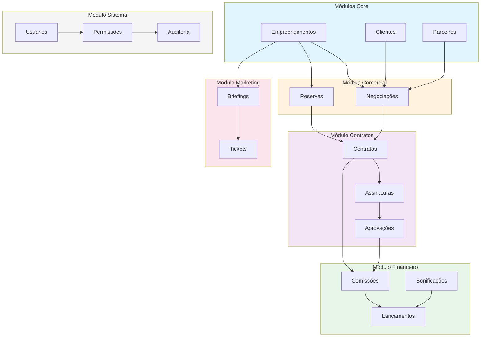

### 1.4 Estrutura de Arquivos por Domínio

```
src/
├── components/
│   ├── agenda/              # Componentes de agenda
│   ├── atividades/          # Gestão de atividades
│   ├── auth/                # Autenticação e autorização
│   ├── briefings/           # Briefings de marketing
│   ├── clientes/            # Gestão de clientes
│   ├── comissoes/           # Comissões
│   ├── configuracoes/       # Configurações do sistema
│   ├── contratos/           # Contratos e templates
│   ├── dashboard/           # Dashboard operacional
│   ├── dashboard-executivo/ # Dashboard executivo
│   ├── empreendimentos/     # Empreendimentos e unidades
│   ├── eventos/             # Eventos
│   ├── financeiro/          # Módulo financeiro
│   ├── forecast/            # Previsão de vendas
│   ├── layout/              # Layout e navegação
│   ├── mapa/                # Mapas interativos
│   ├── marketing/           # Tickets de marketing
│   ├── mercado/             # Corretores e imobiliárias
│   ├── negociacoes/         # Pipeline de vendas
│   ├── portal/              # Portal do corretor
│   ├── ui/                  # Componentes UI base
│   └── usuarios/            # Gestão de usuários
├── hooks/                   # Custom hooks por domínio
├── pages/                   # Páginas/rotas
├── types/                   # Definições de tipos
└── lib/                     # Utilitários
```

---

## 2. Modelos de Dados

### 2.1 Empreendimento

#### Campos

| Campo | Tipo | Obrigatório | Descrição |
|-------|------|-------------|-----------|
| `id` | UUID | Sim (auto) | Identificador único |
| `nome` | string | Sim | Nome do empreendimento |
| `endereco` | string | Não | Endereço completo |
| `cidade` | string | Não | Cidade |
| `uf` | string | Não | Estado (2 caracteres) |
| `cep` | string | Não | CEP |
| `status` | enum | Sim | pre_lancamento, lancamento, em_obras, pronto |
| `data_lancamento` | date | Não | Data do lançamento |
| `data_entrega_prevista` | date | Não | Previsão de entrega |
| `total_unidades` | integer | Não | Total de unidades |
| `unidades_disponiveis` | integer | Não | Unidades disponíveis |
| `valor_medio_m2` | decimal | Não | Valor médio do m² |
| `area_total` | decimal | Não | Área total do terreno |
| `matricula_mae` | string | Não | Número da matrícula mãe |
| `registro_incorporacao` | string | Não | Registro de incorporação |
| `cnpj_spe` | string | Não | CNPJ da SPE |
| `razao_social_spe` | string | Não | Razão social da SPE |
| `is_active` | boolean | Sim | Registro ativo |
| `created_at` | timestamp | Sim (auto) | Data de criação |
| `updated_at` | timestamp | Sim (auto) | Data de atualização |

#### Status Possíveis

| Status | Label | Cor |
|--------|-------|-----|
| `pre_lancamento` | Pré-Lançamento | Amber |
| `lancamento` | Lançamento | Blue |
| `em_obras` | Em Obras | Orange |
| `pronto` | Pronto | Green |

#### Relacionamentos

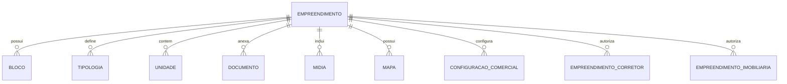

---

### 2.2 Unidade

#### Campos

| Campo | Tipo | Obrigatório | Descrição |
|-------|------|-------------|-----------|
| `id` | UUID | Sim (auto) | Identificador único |
| `empreendimento_id` | UUID | Sim | FK empreendimento |
| `bloco_id` | UUID | Não | FK bloco |
| `tipologia_id` | UUID | Não | FK tipologia |
| `numero` | string | Sim | Número da unidade |
| `andar` | integer | Não | Andar |
| `area_privativa` | decimal | Não | Área privativa (m²) |
| `area_total` | decimal | Não | Área total (m²) |
| `valor` | decimal | Não | Valor da unidade |
| `status` | enum | Sim | disponivel, reservada, vendida, bloqueada |
| `posicao_solar` | string | Não | Posição solar (N, S, L, O) |
| `vagas_garagem` | integer | Não | Número de vagas |
| `observacoes` | text | Não | Observações |
| `is_active` | boolean | Sim | Registro ativo |

#### Status Possíveis

| Status | Label | Cor | Descrição |
|--------|-------|-----|-----------|
| `disponivel` | Disponível | Green | Unidade disponível para venda |
| `reservada` | Reservada | Amber | Unidade em negociação |
| `vendida` | Vendida | Red | Unidade vendida |
| `bloqueada` | Bloqueada | Gray | Unidade indisponível |

---

### 2.3 Cliente

#### Campos

| Campo | Tipo | Obrigatório | Descrição |
|-------|------|-------------|-----------|
| `id` | UUID | Sim (auto) | Identificador único |
| `nome` | string | Sim | Nome completo |
| `cpf` | string | Não | CPF (formatado) |
| `rg` | string | Não | RG |
| `email` | string | Não | E-mail |
| `telefone` | string | Não | Telefone |
| `whatsapp` | string | Não | WhatsApp |
| `data_nascimento` | date | Não | Data de nascimento |
| `nacionalidade` | string | Não | Nacionalidade |
| `estado_civil` | string | Não | Estado civil |
| `profissao` | string | Não | Profissão |
| `renda_mensal` | decimal | Não | Renda mensal |
| `nome_mae` | string | Não | Nome da mãe |
| `nome_pai` | string | Não | Nome do pai |
| `endereco_*` | string | Não | Campos de endereço |
| `fase` | enum | Sim | prospecto, qualificado, negociando, comprador, perdido |
| `temperatura` | enum | Sim | frio, morno, quente |
| `origem` | string | Não | Origem do lead |
| `interesse` | array | Não | Empreendimentos de interesse |
| `corretor_id` | UUID | Não | FK corretor responsável |
| `imobiliaria_id` | UUID | Não | FK imobiliária |
| `gestor_id` | UUID | Não | FK gestor responsável |
| `motivo_perda` | string | Não | Motivo da perda (se perdido) |
| `data_qualificacao` | timestamp | Não | Data de qualificação |
| `data_primeira_negociacao` | timestamp | Não | Data da primeira negociação |
| `data_primeira_compra` | timestamp | Não | Data da primeira compra |
| `data_perda` | timestamp | Não | Data da perda |
| `is_active` | boolean | Sim | Registro ativo |

#### Fases do Cliente

| Fase | Label | Descrição |
|------|-------|-----------|
| `prospecto` | Prospecto | Lead inicial |
| `qualificado` | Qualificado | Lead qualificado |
| `negociando` | Negociando | Em negociação ativa |
| `comprador` | Comprador | Realizou compra |
| `perdido` | Perdido | Lead perdido |

#### Temperatura

| Temperatura | Label | Cor |
|-------------|-------|-----|
| `frio` | Frio | Blue |
| `morno` | Morno | Amber |
| `quente` | Quente | Red |

---

### 2.4 Negociação

#### Campos

| Campo | Tipo | Obrigatório | Descrição |
|-------|------|-------------|-----------|
| `id` | UUID | Sim (auto) | Identificador único |
| `codigo` | string | Sim (auto) | Código sequencial (NEG-00001) |
| `cliente_id` | UUID | Sim | FK cliente |
| `empreendimento_id` | UUID | Sim | FK empreendimento |
| `corretor_id` | UUID | Não | FK corretor |
| `imobiliaria_id` | UUID | Não | FK imobiliária |
| `gestor_id` | UUID | Não | FK gestor |
| `funil_etapa_id` | UUID | Não | FK etapa do funil |
| `valor_negociacao` | decimal | Não | Valor total |
| `observacoes` | text | Não | Observações |
| `motivo_perda` | string | Não | Motivo da perda |
| `ordem_kanban` | integer | Não | Ordem no Kanban |
| **Campos de Aprovação (Gatekeeper)** | | | |
| `status_aprovacao` | enum | Não | pendente, aprovada, rejeitada |
| `solicitada_em` | timestamp | Não | Data/hora da solicitação |
| `aprovada_em` | timestamp | Não | Data/hora da aprovação |
| `rejeitada_em` | timestamp | Não | Data/hora da rejeição |
| `motivo_rejeicao` | text | Não | Motivo da rejeição |
| `valor_total_fechamento` | decimal | Não | Valor final fechado |
| `condicao_pagamento` | JSONB | Não | Condições de pagamento estruturadas |
| `indice_correcao` | text | Não | Índice de correção (INCC, IPCA) |
| `created_by` | UUID | Não | Usuário que criou |
| `updated_by` | UUID | Não | Último usuário que editou |
| **Campos de Proposta** | | | |
| `proposta_numero` | string | Não | Número da proposta |
| `proposta_data` | date | Não | Data da proposta |
| `proposta_validade` | date | Não | Validade da proposta |
| `status_proposta` | enum | Não | Status da proposta |
| `valor_proposta` | decimal | Não | Valor da proposta |
| `entrada_proposta` | decimal | Não | Valor de entrada |
| `parcelas_proposta` | integer | Não | Número de parcelas |
| `valor_parcela_proposta` | decimal | Não | Valor das parcelas |
| `observacoes_proposta` | text | Não | Observações da proposta |
| `proposta_recusada_motivo` | text | Não | Motivo de recusa |
| `proposta_aceita_em` | timestamp | Não | Data de aceite |
| `is_active` | boolean | Sim | Registro ativo |

#### Status de Aprovação (Gatekeeper)

| Status | Label | Cor | Descrição |
|--------|-------|-----|-----------|
| `pendente` | Pendente | Amber | Aguardando aprovação do gestor |
| `aprovada` | Aprovada | Green | Aprovada, unidades reservadas |
| `rejeitada` | Rejeitada | Red | Rejeitada, unidades liberadas |

#### Status da Proposta

| Status | Label | Cor |
|--------|-------|-----|
| `rascunho` | Rascunho | Slate |
| `enviada` | Enviada | Blue |
| `aceita` | Aceita | Green |
| `recusada` | Recusada | Red |
| `expirada` | Expirada | Gray |
| `convertida` | Convertida em Contrato | Emerald |

#### Relacionamentos

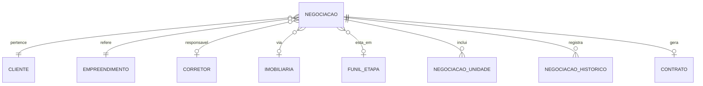

---

### 2.5 Contrato

#### Campos

| Campo | Tipo | Obrigatório | Descrição |
|-------|------|-------------|-----------|
| `id` | UUID | Sim (auto) | Identificador único |
| `numero` | string | Sim (auto) | Número sequencial (CONT-00001) |
| `cliente_id` | UUID | Sim | FK cliente |
| `empreendimento_id` | UUID | Sim | FK empreendimento |
| `corretor_id` | UUID | Não | FK corretor |
| `imobiliaria_id` | UUID | Não | FK imobiliária |
| `gestor_id` | UUID | Não | FK gestor |
| `template_id` | UUID | Não | FK template |
| `status` | enum | Sim | Status do contrato |
| `conteudo_html` | text | Não | Conteúdo HTML do contrato |
| `versao` | integer | Sim | Versão atual |
| `valor_contrato` | decimal | Não | Valor total |
| `percentual_corretagem` | decimal | Não | % de corretagem |
| `valor_corretagem` | decimal | Não | Valor da corretagem |
| `corretagem_texto` | text | Não | Texto descritivo da corretagem |
| `data_geracao` | date | Sim | Data de geração |
| `data_envio_assinatura` | date | Não | Data de envio para assinatura |
| `data_assinatura` | date | Não | Data da assinatura |
| `data_envio_incorporador` | date | Não | Data de envio ao incorporador |
| `data_aprovacao` | date | Não | Data de aprovação |
| `motivo_reprovacao` | text | Não | Motivo de reprovação |
| `observacoes` | text | Não | Observações |
| `is_active` | boolean | Sim | Registro ativo |

#### Status do Contrato

| Status | Label | Cor |
|--------|-------|-----|
| `em_geracao` | Em Geração | Slate |
| `enviado_assinatura` | Enviado p/ Assinatura | Blue |
| `assinado` | Assinado | Green |
| `enviado_incorporador` | Enviado ao Incorporador | Amber |
| `aprovado` | Aprovado | Emerald |
| `reprovado` | Reprovado | Red |
| `cancelado` | Cancelado | Gray |

#### Relacionamentos

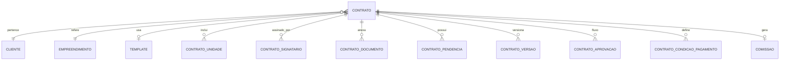

---

### 2.6 Comissão

#### Campos

| Campo | Tipo | Obrigatório | Descrição |
|-------|------|-------------|-----------|
| `id` | UUID | Sim (auto) | Identificador único |
| `numero` | string | Sim | Número da comissão |
| `contrato_id` | UUID | Não | FK contrato |
| `empreendimento_id` | UUID | Sim | FK empreendimento |
| `corretor_id` | UUID | Não | FK corretor |
| `imobiliaria_id` | UUID | Não | FK imobiliária |
| `gestor_id` | UUID | Não | FK gestor |
| `valor_venda` | decimal | Sim | Valor da venda |
| `percentual_comissao` | decimal | Não | % total de comissão |
| `valor_comissao` | decimal | Não | Valor total da comissão |
| `percentual_imobiliaria` | decimal | Não | % para imobiliária |
| `valor_imobiliaria` | decimal | Não | Valor para imobiliária |
| `percentual_corretor` | decimal | Não | % para corretor |
| `valor_corretor` | decimal | Não | Valor para corretor |
| `status_imobiliaria` | enum | Sim | Status pgto imobiliária |
| `status_corretor` | enum | Sim | Status pgto corretor |
| `data_pagamento_imobiliaria` | date | Não | Data pgto imobiliária |
| `data_pagamento_corretor` | date | Não | Data pgto corretor |
| `nf_imobiliaria` | string | Não | NF da imobiliária |
| `nf_corretor` | string | Não | NF do corretor |
| `observacoes` | text | Não | Observações |
| **Campos de Estorno** | | | |
| `estornada` | boolean | Não | Se foi estornada |
| `data_estorno` | timestamp | Não | Data do estorno |
| **Campos de Auditoria** | | | |
| `created_by` | UUID | Não | Usuário que criou |
| `updated_by` | UUID | Não | Último usuário que editou |
| `is_active` | boolean | Sim | Registro ativo |

#### Status da Comissão

| Status | Label | Cor |
|--------|-------|-----|
| `pendente` | Pendente | Amber |
| `aprovada` | Aprovada | Blue |
| `paga` | Paga | Green |
| `cancelada` | Cancelada | Gray |

---

### 2.7 Signatário de Contrato

#### Campos

| Campo | Tipo | Obrigatório | Descrição |
|-------|------|-------------|-----------|
| `id` | UUID | Sim (auto) | Identificador único |
| `contrato_id` | UUID | Sim | FK contrato |
| `nome` | string | Sim | Nome do signatário |
| `cpf` | string | Não | CPF |
| `email` | string | Não | E-mail |
| `telefone` | string | Não | Telefone |
| `tipo` | enum | Sim | comprador, vendedor, testemunha, etc. |
| `ordem` | integer | Sim | Ordem de assinatura |
| `status` | enum | Sim | pendente, enviado, visualizado, assinado, recusado |
| `obrigatorio` | boolean | Sim | Se a assinatura é obrigatória |
| `token_assinatura` | string | Não | Token único para assinatura |
| `data_envio` | timestamp | Não | Data de envio do e-mail |
| `data_visualizacao` | timestamp | Não | Data de visualização |
| `data_assinatura` | timestamp | Não | Data da assinatura |
| `ip_assinatura` | string | Não | IP do dispositivo |
| `user_agent` | string | Não | User agent do navegador |
| `motivo_recusa` | text | Não | Motivo da recusa |
| **Campos de Cônjuge** | | | |
| `tem_conjuge` | boolean | Não | Se tem cônjuge que deve assinar |
| `conjuge_nome` | string | Não | Nome do cônjuge |
| `conjuge_cpf` | string | Não | CPF do cônjuge |
| `conjuge_email` | string | Não | E-mail do cônjuge |
| `regime_bens` | text | Não | Regime de bens do casamento |

**Validação de Cônjuge:** Se `tem_conjuge = true`, os campos `conjuge_nome` e `conjuge_cpf` são obrigatórios (validado via trigger).

---

### 2.7 Ticket (Marketing)

#### Campos

| Campo | Tipo | Obrigatório | Descrição |
|-------|------|-------------|-----------|
| `id` | UUID | Sim (auto) | Identificador único |
| `codigo` | string | Sim (auto) | Código sequencial (TKT-00001) |
| `titulo` | string | Sim | Título do ticket |
| `descricao` | text | Não | Descrição detalhada |
| `empreendimento_id` | UUID | Não | FK empreendimento |
| `etapa_id` | UUID | Sim | FK etapa do Kanban |
| `criado_por` | UUID | Sim | FK usuário criador |
| `responsavel_id` | UUID | Não | FK usuário responsável |
| `tipo` | enum | Sim | Tipo do projeto |
| `prioridade` | enum | Sim | Prioridade |
| `data_inicio` | date | Não | Data de início |
| `data_entrega` | date | Não | Data de entrega |
| `data_conclusao` | date | Não | Data de conclusão |
| `ordem` | integer | Não | Ordem no Kanban |
| `is_active` | boolean | Sim | Registro ativo |

#### Tipos de Projeto

| Tipo | Label |
|------|-------|
| `social_media` | Social Media |
| `design` | Design |
| `video` | Vídeo |
| `render` | Render 3D |
| `campanha` | Campanha |
| `evento` | Evento |
| `material_impresso` | Material Impresso |
| `outros` | Outros |

#### Prioridades

| Prioridade | Label | Cor |
|------------|-------|-----|
| `baixa` | Baixa | Slate |
| `media` | Média | Blue |
| `alta` | Alta | Amber |
| `urgente` | Urgente | Red |

---

### 2.8 Evento

#### Campos

| Campo | Tipo | Obrigatório | Descrição |
|-------|------|-------------|-----------|
| `id` | UUID | Sim (auto) | Identificador único |
| `titulo` | string | Sim | Título do evento |
| `descricao` | text | Não | Descrição |
| `empreendimento_id` | UUID | Não | FK empreendimento |
| `tipo` | enum | Sim | Tipo do evento |
| `status` | enum | Sim | Status do evento |
| `data_inicio` | timestamp | Sim | Data/hora de início |
| `data_fim` | timestamp | Não | Data/hora de término |
| `local` | string | Não | Local do evento |
| `endereco` | string | Não | Endereço |
| `responsavel_id` | UUID | Não | FK responsável |
| `orcamento_previsto` | decimal | Não | Orçamento previsto |
| `orcamento_realizado` | decimal | Não | Orçamento realizado |
| `publico_esperado` | integer | Não | Público esperado |
| `publico_presente` | integer | Não | Público presente |
| `observacoes` | text | Não | Observações |
| `is_active` | boolean | Sim | Registro ativo |

#### Status do Evento

| Status | Label | Cor |
|--------|-------|-----|
| `planejamento` | Planejamento | Slate |
| `confirmado` | Confirmado | Blue |
| `em_andamento` | Em Andamento | Amber |
| `realizado` | Realizado | Green |
| `cancelado` | Cancelado | Gray |

---

### 2.9 Briefing

#### Campos

| Campo | Tipo | Obrigatório | Descrição |
|-------|------|-------------|-----------|
| `id` | UUID | Sim (auto) | Identificador único |
| `codigo` | string | Sim | Código do briefing |
| `tema` | string | Sim | Tema principal |
| `cliente` | string | Sim | Cliente solicitante |
| `empreendimento_id` | UUID | Não | FK empreendimento |
| `criado_por` | UUID | Sim | FK usuário criador |
| `triado_por` | UUID | Não | FK usuário que triou |
| `status` | enum | Sim | Status do briefing |
| `head_titulo` | string | Não | Título principal |
| `sub_complemento` | string | Não | Subtítulo |
| `objetivo` | text | Não | Objetivo da peça |
| `mensagem_chave` | text | Não | Mensagem chave |
| `tom_comunicacao` | string | Não | Tom de comunicação |
| `estilo_visual` | string | Não | Estilo visual |
| `formato_peca` | string | Não | Formato da peça |
| `composicao` | text | Não | Composição |
| `diretrizes_visuais` | text | Não | Diretrizes visuais |
| `referencia` | text | Não | Referências |
| `importante` | text | Não | Informações importantes |
| `observacoes` | text | Não | Observações |
| `data_entrega` | timestamp | Não | Data de entrega |
| `data_triagem` | timestamp | Não | Data da triagem |
| `is_active` | boolean | Sim | Registro ativo |

#### Status do Briefing

| Status | Label | Cor |
|--------|-------|-----|
| `pendente` | Pendente | Amber |
| `triado` | Triado | Blue |
| `em_producao` | Em Produção | Purple |
| `concluido` | Concluído | Green |
| `cancelado` | Cancelado | Gray |

---

### 2.10 Usuário (Profile)

#### Campos

| Campo | Tipo | Obrigatório | Descrição |
|-------|------|-------------|-----------|
| `id` | UUID | Sim | ID do auth.users |
| `email` | string | Sim | E-mail (único) |
| `full_name` | string | Não | Nome completo |
| `avatar_url` | string | Não | URL do avatar |
| `is_active` | boolean | Sim | Usuário ativo |
| `created_at` | timestamp | Sim (auto) | Data de criação |
| `updated_at` | timestamp | Sim (auto) | Data de atualização |

#### Relacionamentos

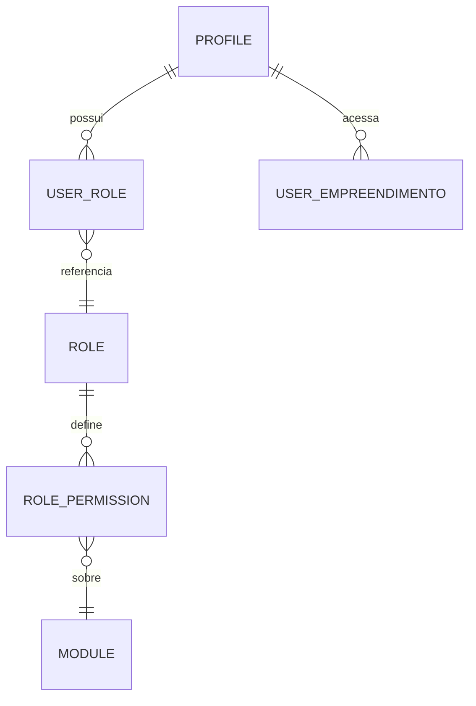

---

## 3. Fluxos e Regras de Negócio

### 3.1 Gatilhos Automáticos (Database Triggers)

| Trigger | Tabela | Evento | Ação |
|---------|--------|--------|------|
| `generate_negociacao_codigo` | negociacoes | INSERT | Gera código NEG-XXXXX sequencial |
| `generate_contrato_numero` | contratos | INSERT | Gera número CONT-XXXXX sequencial |
| `update_updated_at` | várias | UPDATE | Atualiza campo updated_at |
| `audit_trigger_func` | várias | INSERT/UPDATE/DELETE | Registra alteração no audit_logs |
| `handle_new_user` | auth.users | INSERT | Cria profile automaticamente |
| `trigger_validate_conjuge` | contrato_signatarios | INSERT/UPDATE | Valida dados obrigatórios do cônjuge |
| `trigger_liberar_unidades_cancelamento` | negociacoes | UPDATE | Libera unidades quando aprovação é revertida |

### 3.2 Funções RPC (Remote Procedure Calls)

| Função | Parâmetros | Descrição |
|--------|------------|-----------|
| `generate_proposta_numero` | negociacao_id | Gera número de proposta PROP-XXXXX |
| `check_proposta_expiracao` | - | Verifica e expira propostas vencidas |
| `is_admin` | user_id | Verifica se usuário é admin |
| `is_super_admin` | user_id | Verifica se usuário é super admin |
| `has_role` | user_id, role_name | Verifica se usuário tem papel |
| `user_has_empreendimento_access` | user_id, empreendimento_id | Verifica acesso ao empreendimento |
| `is_seven_team` | user_id | Verifica se é equipe Seven |
| `aprovar_solicitacao_negociacao` | negociacao_id, gestor_id | Aprova solicitação, reserva unidades, rejeita conflitantes |
| `rejeitar_solicitacao_negociacao` | negociacao_id, motivo, gestor_id | Rejeita solicitação com motivo |

### 3.3 Fluxo de Solicitação de Reserva (Gatekeeper)

O sistema implementa um modelo **Gatekeeper** onde corretores não podem reservar unidades diretamente. Eles enviam "Solicitações de Reserva" que são aprovadas ou rejeitadas por gestores.

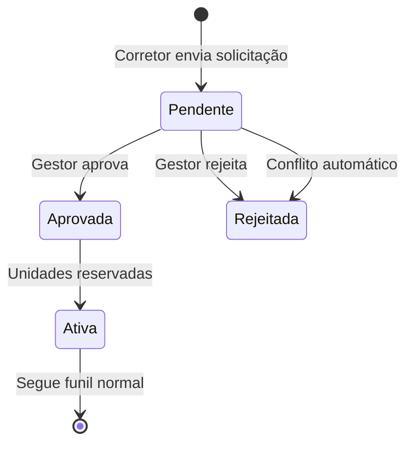

**Conceito Gatekeeper:**
- Corretores selecionam unidades no mapa e enviam "Solicitação de Reserva"
- Solicitações ficam com `status_aprovacao = 'pendente'`
- Gestores (Seven) recebem a solicitação na fila `/solicitacoes`
- Sistema detecta automaticamente conflitos (mesma unidade em múltiplas solicitações)
- Reserva só acontece na **APROVAÇÃO**, não na solicitação
- Ao aprovar, conflitos são rejeitados automaticamente com motivo "Unidade reservada por outra negociação"

**Fluxo de Aprovação:**
1. Corretor seleciona unidades no mapa
2. Corretor preenche dados do cliente e envia solicitação
3. Sistema cria negociação com `status_aprovacao = 'pendente'`
4. Unidades permanecem como `disponivel` (não são reservadas ainda)
5. Gestor visualiza na fila de solicitações
6. Gestor pode editar (remover unidades), aprovar ou rejeitar
7. Ao aprovar: unidades mudam para `reservada`, conflitos são rejeitados
8. Ao rejeitar: solicitação é arquivada com motivo

**Tratamento de Conflitos:**
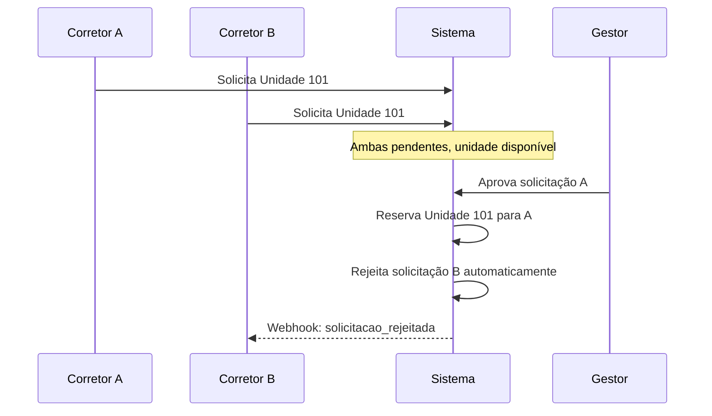

### 3.4 Fluxo de Negociação (Pós-Aprovação)

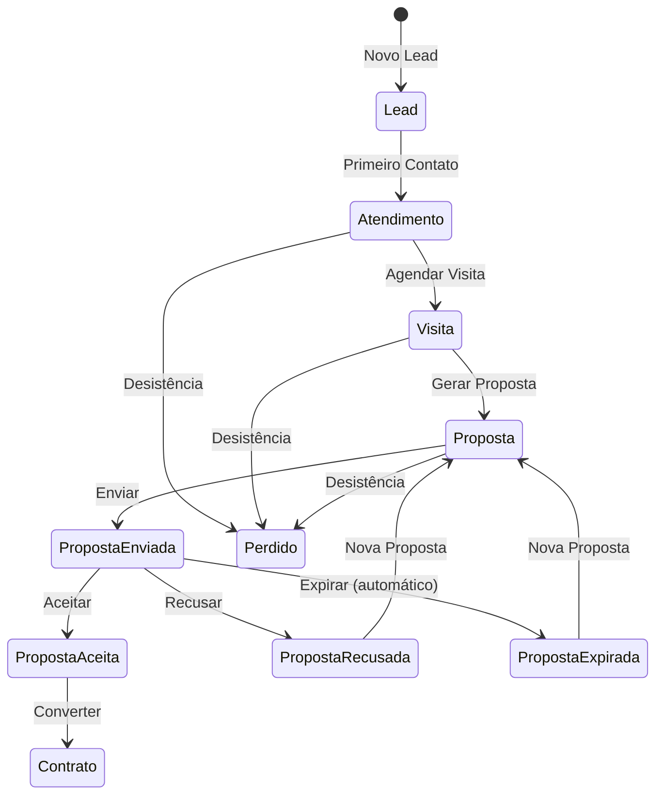

**Regras de Transição:**

1. **Lead → Atendimento**: Requer primeiro contato registrado
2. **Atendimento → Visita**: Requer agendamento de visita
3. **Visita → Proposta**: Pode gerar proposta após visita
4. **Proposta → Contrato**: Apenas propostas aceitas podem virar contrato
5. **Expiração Automática**: Propostas vencem após data de validade

**Ações Automáticas:**
- Ao mover para etapa final de sucesso: Gera contrato automaticamente (opcional)
- Ao mover para etapa final de perda: Registra motivo e data da perda
- Ao gerar proposta: Reserva unidades selecionadas
- Ao cancelar proposta: Libera unidades reservadas

### 3.5 Fluxo de Contrato

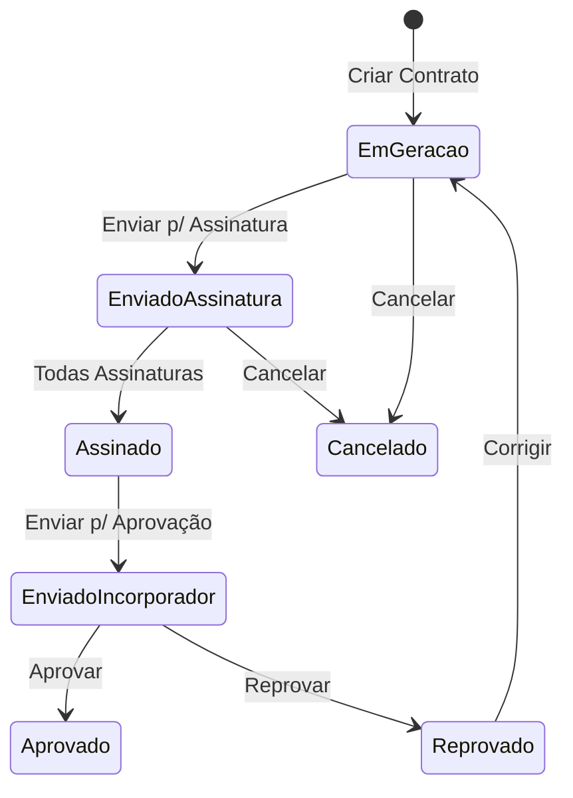

**Regras de Transição:**

1. **EmGeracao → EnviadoAssinatura**: 
   - Requer template selecionado
   - Requer pelo menos um signatário
   - Gera token de assinatura para cada signatário

2. **EnviadoAssinatura → Assinado**:
   - Todos os signatários obrigatórios devem assinar
   - Registra IP, data/hora e user agent

3. **Assinado → EnviadoIncorporador**:
   - Contrato completo com todas assinaturas

4. **EnviadoIncorporador → Aprovado**:
   - Aprovação do incorporador
   - Gera comissão automaticamente
   - Atualiza status da unidade para "vendida"
   - Dispara webhook de contrato aprovado

5. **EnviadoIncorporador → Reprovado**:
   - Requer motivo de reprovação
   - Volta para geração para correções

### 3.6 Fluxo de Assinatura Digital

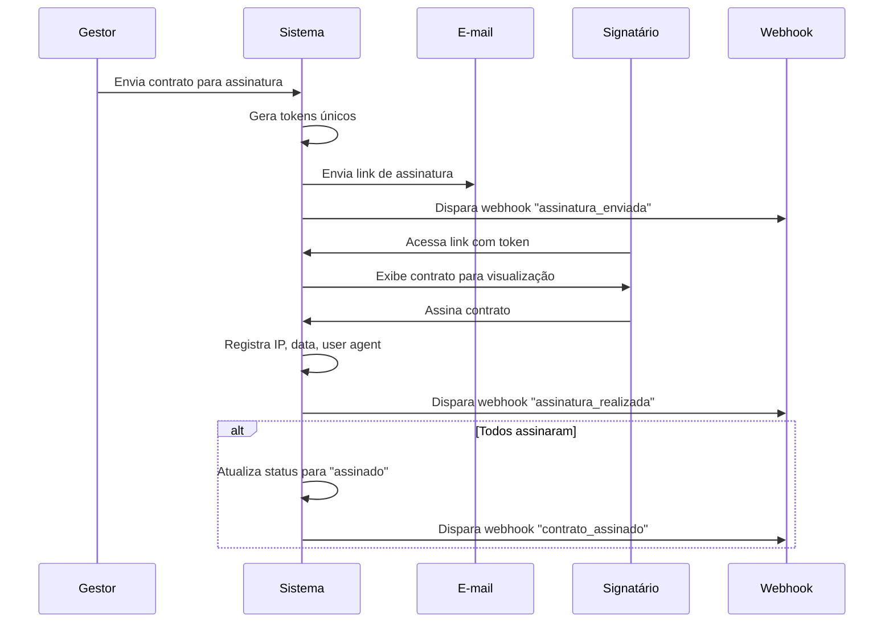

### 3.7 Fluxo de Comissão

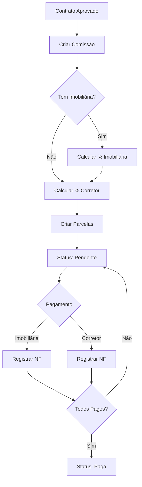

**Cálculos Automáticos:**

```typescript
// Valor da comissão
valor_comissao = valor_venda * (percentual_comissao / 100)

// Divisão Imobiliária/Corretor
valor_imobiliaria = valor_comissao * (percentual_imobiliaria / 100)
valor_corretor = valor_comissao * (percentual_corretor / 100)

// Configuração padrão vem de configuracao_comissoes por empreendimento
```

### 3.8 Validações Implementadas

#### Negociação
- Cliente obrigatório
- Empreendimento obrigatório
- Unidade(s) devem estar disponíveis ou reservadas pelo mesmo cliente
- Valor de proposta deve ser positivo
- Data de validade deve ser futura

#### Solicitação de Reserva (Gatekeeper)
- Corretor só pode criar com `status_aprovacao = 'pendente'`
- Pelo menos uma unidade selecionada
- Unidades devem estar disponíveis no momento da solicitação
- Cliente deve ter nome preenchido

#### Contrato
- Cliente obrigatório
- Empreendimento obrigatório
- Pelo menos uma unidade
- Template selecionado para enviar para assinatura
- Pelo menos um signatário para enviar para assinatura

#### Signatário com Cônjuge
- Se `tem_conjuge = true`, `conjuge_nome` e `conjuge_cpf` são obrigatórios
- Validação feita via trigger `validate_conjuge_data`

#### Comissão
- Empreendimento obrigatório
- Valor de venda obrigatório
- Percentuais devem ser positivos

#### Usuário
- E-mail único
- Pelo menos um papel atribuído
- Super Admin não pode ser desativado

### 3.9 Regras de Status de Unidade

| Ação | Status Anterior | Status Novo |
|------|-----------------|-------------|
| Solicitar reserva (Gatekeeper) | disponivel | disponivel (sem alteração) |
| Aprovar solicitação | disponivel | reservada |
| Rejeitar solicitação | disponivel | disponivel (sem alteração) |
| Criar negociação com unidade (legado) | disponivel | reservada |
| Gerar proposta | disponivel/reservada | reservada |
| Aceitar proposta | reservada | reservada |
| Contrato aprovado | reservada | vendida |
| Cancelar negociação aprovada | reservada | disponivel |
| Cancelar contrato | reservada/vendida | disponivel |
| Bloquear manualmente | qualquer | bloqueada |

---

## 4. Controles de Acesso

### 4.1 Papéis de Usuário

| Role | Nome | Nível | Descrição |
|------|------|-------|-----------|
| `super_admin` | Super Administrador | 1 | Acesso total, configurações do sistema |
| `admin` | Administrador | 2 | Acesso administrativo, sem config sistema |
| `gestor_produto` | Gestor de Produto | 3 | Gestão dos empreendimentos vinculados |
| `incorporador` | Incorporador | 4 | Visualização e aprovação |
| `corretor` | Corretor | 5 | Criação de negociações e contratos |
| `supervisor_relacionamento` | Supervisor Relacionamento | 3 | Gestão de eventos |
| `supervisor_render` | Supervisor Render | 3 | Gestão de projetos 3D |
| `supervisor_criacao` | Supervisor Criação | 3 | Gestão de projetos de design |
| `supervisor_video` | Supervisor Vídeo | 3 | Gestão de projetos de vídeo |
| `equipe_marketing` | Equipe Marketing | 4 | Execução de projetos |
| `cliente_externo` | Cliente Externo | 5 | Aprovação de materiais |

### 4.2 Módulos do Sistema

| Módulo | Código | Descrição |
|--------|--------|-----------|
| Dashboard | `dashboard` | Visualização de métricas |
| Empreendimentos | `empreendimentos` | Gestão de empreendimentos |
| Clientes | `clientes` | Gestão de clientes |
| Negociações | `negociacoes` | Pipeline de vendas |
| Contratos | `contratos` | Gestão de contratos |
| Comissões | `comissoes` | Gestão de comissões |
| Financeiro | `financeiro` | Lançamentos financeiros |
| Marketing | `marketing` | Tickets de marketing |
| Eventos | `eventos` | Gestão de eventos |
| Usuários | `usuarios` | Gestão de usuários |
| Configurações | `configuracoes` | Configurações do sistema |
| Auditoria | `auditoria` | Logs de auditoria |

### 4.3 Permissões por Módulo

Cada módulo possui 4 tipos de permissão:

| Permissão | Ação | Descrição |
|-----------|------|-----------|
| `can_view` | Visualizar | Ver registros |
| `can_create` | Criar | Criar novos registros |
| `can_edit` | Editar | Modificar registros existentes |
| `can_delete` | Excluir | Remover registros |

### 4.4 Escopos de Acesso

| Escopo | Código | Descrição |
|--------|--------|-----------|
| Global | `global` | Acesso a todos os registros |
| Empreendimento | `empreendimento` | Apenas empreendimentos vinculados |
| Próprio | `proprio` | Apenas registros próprios |

### 4.5 Matriz de Permissões Padrão

| Role | Dashboard | Empreendimentos | Clientes | Negociações | Contratos | Comissões | Financeiro | Marketing | Usuários |
|------|-----------|-----------------|----------|-------------|-----------|-----------|------------|-----------|----------|
| super_admin | CRUD | CRUD | CRUD | CRUD | CRUD | CRUD | CRUD | CRUD | CRUD |
| admin | CRUD | CRUD | CRUD | CRUD | CRUD | CRUD | CRUD | CRUD | CRU |
| gestor_produto | R | CRUD* | CRUD* | CRUD* | CRUD* | R* | R* | R | - |
| incorporador | R | R* | R* | R* | R* | - | - | R | - |
| corretor | R | R* | CRU* | CRU* | CR* | R* | - | - | - |
| equipe_marketing | R | R | - | - | - | - | - | CRUD | - |

*Legenda:*
- C = Create, R = Read, U = Update, D = Delete
- \* = Escopo limitado (empreendimento ou próprio)
- \- = Sem acesso

### 4.6 Políticas RLS (Row Level Security)

As principais políticas implementadas:

#### Empreendimentos
```sql
-- Admins podem gerenciar todos
CREATE POLICY "Admins can manage empreendimentos" ON empreendimentos
FOR ALL USING (is_admin(auth.uid()));

-- Usuários veem empreendimentos autorizados
CREATE POLICY "Users can view authorized empreendimentos" ON empreendimentos
FOR SELECT USING (
  is_admin(auth.uid()) OR
  has_role(auth.uid(), 'gestor_produto') OR
  user_has_empreendimento_access(auth.uid(), id)
);
```

#### Negociações
```sql
-- Corretores veem próprias negociações
CREATE POLICY "Corretores can view own negociacoes" ON negociacoes
FOR SELECT USING (
  corretor_id IN (
    SELECT c.id FROM corretores c
    JOIN profiles p ON p.email = c.email
    WHERE p.id = auth.uid()
  )
);

-- Corretores só podem criar com status pendente (Gatekeeper)
CREATE POLICY "Corretores insert pendente only" ON negociacoes
FOR INSERT WITH CHECK (
  is_admin(auth.uid()) OR
  has_role(auth.uid(), 'gestor_produto') OR
  (status_aprovacao IS NULL OR status_aprovacao = 'pendente')
);

-- Gestores podem aprovar/rejeitar
CREATE POLICY "Gestores update aprovacao" ON negociacoes
FOR UPDATE USING (
  (is_admin(auth.uid()) OR has_role(auth.uid(), 'gestor_produto')) AND
  user_has_empreendimento_access(auth.uid(), empreendimento_id)
);
```

#### Negociação Unidades
```sql
-- Gestores podem remover itens de solicitações pendentes
CREATE POLICY "Gestores delete itens pendentes" ON negociacao_unidades
FOR DELETE USING (
  is_admin(auth.uid()) OR
  has_role(auth.uid(), 'gestor_produto')
);
```

#### Contratos
```sql
-- Corretores podem criar contratos
CREATE POLICY "Corretores can create contratos" ON contratos
FOR INSERT WITH CHECK (true);

-- Corretores veem próprios contratos
CREATE POLICY "Corretores can view own contratos" ON contratos
FOR SELECT USING (
  corretor_id IN (
    SELECT c.id FROM corretores c
    JOIN profiles p ON p.email = c.email
    WHERE p.id = auth.uid()
  )
);
```

### 4.7 Hierarquia de Acesso

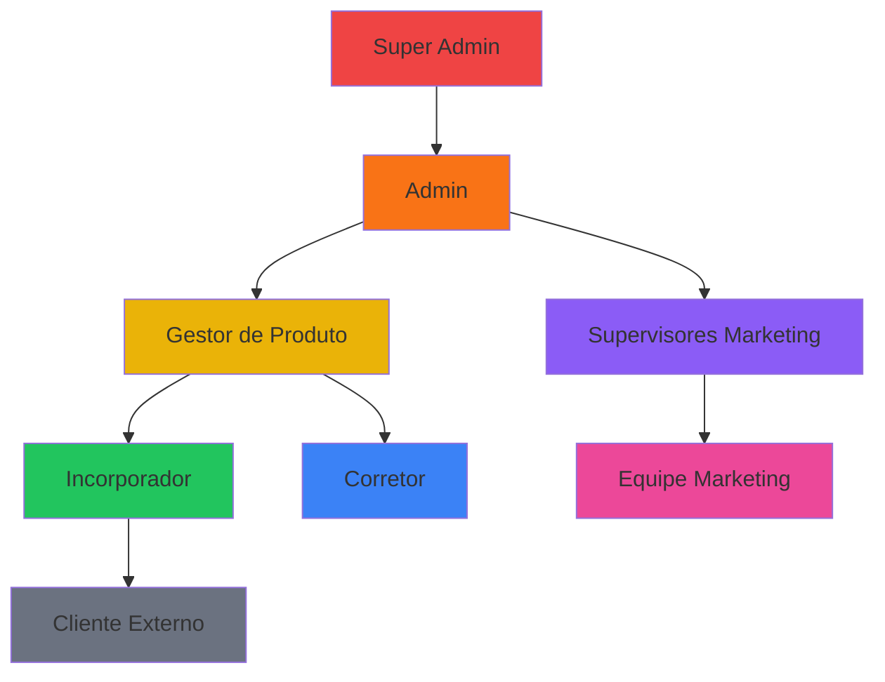

---

## 5. Integrações e Automações

### 5.1 Edge Functions (Supabase)

#### create-user
**Endpoint:** `POST /functions/v1/create-user`

**Descrição:** Cria novos usuários no sistema (apenas admins)

**Payload:**
```typescript
{
  email: string;
  password: string;
  full_name: string;
  role_id: string;
  empreendimento_ids?: string[];
}
```

**Fluxo:**
1. Valida permissão do requisitante
2. Cria usuário no auth.users
3. Profile é criado automaticamente via trigger
4. Atribui papel (user_roles)
5. Vincula empreendimentos (user_empreendimentos)

#### webhook-dispatcher
**Endpoint:** `POST /functions/v1/webhook-dispatcher`

**Descrição:** Dispara webhooks para sistemas externos

**Payload:**
```typescript
{
  event_type: string;
  payload: Record<string, any>;
}
```

**Eventos Disponíveis:**
| Evento | Descrição |
|--------|-----------|
| `negociacao_criada` | Nova negociação criada |
| `solicitacao_criada` | Nova solicitação de reserva criada (Gatekeeper) |
| `solicitacao_aprovada` | Solicitação aprovada pelo gestor |
| `solicitacao_rejeitada` | Solicitação rejeitada (manual ou por conflito) |
| `proposta_enviada` | Proposta enviada ao cliente |
| `proposta_aceita` | Proposta aceita pelo cliente |
| `contrato_gerado` | Contrato gerado |
| `assinatura_enviada` | Contrato enviado para assinatura |
| `assinatura_realizada` | Signatário assinou |
| `contrato_assinado` | Todas as assinaturas coletadas |
| `contrato_aprovado` | Contrato aprovado pelo incorporador |
| `contrato_reprovado` | Contrato reprovado |

#### webhook-assinatura
**Endpoint:** `POST /functions/v1/webhook-assinatura`

**Descrição:** Processa assinaturas digitais de contratos

**Payload:**
```typescript
{
  token: string;  // Token único do signatário
  action: 'visualizar' | 'assinar' | 'recusar';
  ip_address?: string;
  user_agent?: string;
  motivo_recusa?: string;
}
```

### 5.2 Webhooks Configuráveis

O sistema permite configurar webhooks externos via tabela `webhooks`:

| Campo | Tipo | Descrição |
|-------|------|-----------|
| `id` | UUID | Identificador |
| `nome` | string | Nome do webhook |
| `url` | string | URL de destino |
| `eventos` | array | Eventos que disparam |
| `headers` | jsonb | Headers customizados |
| `is_active` | boolean | Ativo/Inativo |

**Exemplo de Configuração:**
```json
{
  "nome": "Integração n8n",
  "url": "https://n8n.exemplo.com/webhook/abc123",
  "eventos": ["contrato_aprovado", "proposta_aceita"],
  "headers": {
    "Authorization": "Bearer token123"
  },
  "is_active": true
}
```

### 5.3 Storage Buckets

| Bucket | Público | Uso | Políticas |
|--------|---------|-----|-----------|
| `empreendimentos-midias` | Sim | Imagens e vídeos de empreendimentos | Admins e gestores podem upload |
| `empreendimentos-documentos` | Não | Documentos oficiais | Usuários autorizados podem visualizar |
| `contratos-documentos` | Não | Anexos de contratos | Corretor do contrato ou admin |
| `projetos-arquivos` | Não | Arquivos de tickets marketing | Equipe marketing |
| `contrato-templates` | Não | Imagens para templates | Admins e gestores |

### 5.4 Integrações Externas Suportadas

#### Via Webhooks
- **n8n / Make (Integromat) / Zapier**: Automação de workflows
- **WhatsApp Business API**: Notificações automáticas
- **E-mail (SMTP/API)**: Envio de e-mails transacionais
- **CRMs externos**: Sincronização de dados

#### Configuração Recomendada

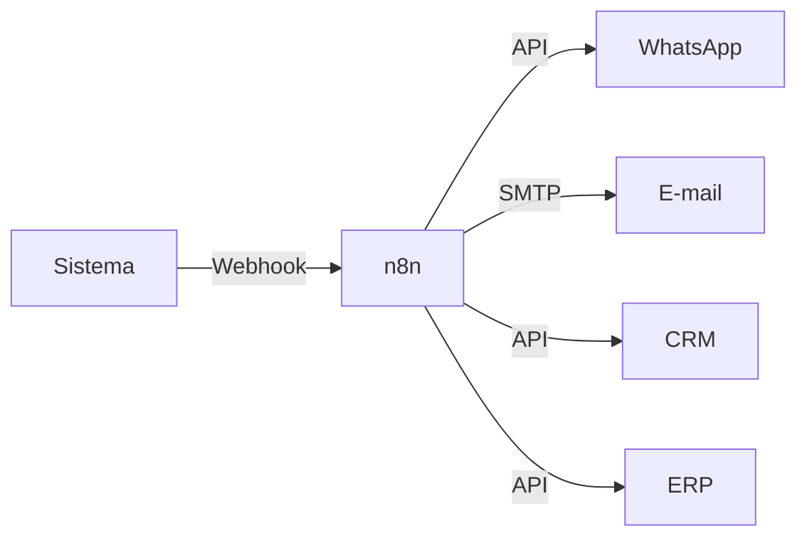

### 5.5 Exportações de Dados

| Módulo | Formato | Campos Exportados |
|--------|---------|-------------------|
| Clientes | XLSX | Todos os campos do cadastro |
| Negociações | XLSX | Código, cliente, empreendimento, valor, status |
| Contratos | XLSX | Número, cliente, unidades, valor, status |
| Comissões | XLSX | Número, contrato, valores, status pagamento |
| Financeiro | XLSX | Lançamentos do período |
| Auditoria | XLSX | Logs de alterações |

### 5.6 Processamentos Agendados (Sugestão)

O sistema pode se beneficiar dos seguintes cron jobs (a implementar):

| Job | Frequência | Ação |
|-----|------------|------|
| `check_proposta_expiracao` | Diário 00:00 | Expira propostas vencidas |
| `enviar_lembretes_followup` | Diário 08:00 | Envia lembretes de atividades |
| `gerar_relatorio_diario` | Diário 23:00 | Gera relatório de vendas |
| `sincronizar_unidades` | A cada 1h | Sincroniza status de unidades |
| `backup_audit_logs` | Semanal | Arquiva logs antigos |

---

## 6. Pontos de Interação do Usuário

### 6.1 Mapa de Navegação

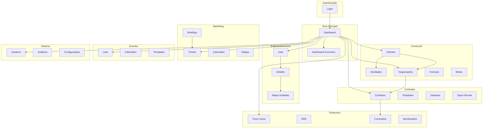

### 6.2 Telas Principais

#### Dashboard Operacional (`/`)
| Elemento | Descrição | Ações |
|----------|-----------|-------|
| KPIs | Métricas principais de vendas | Visualização |
| Gráfico de Vendas | Evolução de vendas por período | Filtro por período |
| Ranking Corretores | Top corretores por vendas | - |
| Funil de Vendas | Visualização do pipeline | Click para filtrar |
| Atividades Pendentes | Próximas atividades | Marcar como concluída |

#### Dashboard Executivo (`/dashboard-executivo`)
| Elemento | Descrição | Ações |
|----------|-----------|-------|
| KPIs Executivos | VGV, Ticket Médio, Conversão | Visualização |
| Tendências | Gráficos de tendência | Filtro por período |
| Alertas | Avisos importantes | Ver detalhes |
| Status por Módulo | Saúde dos módulos | - |
| Funil Mini | Resumo do pipeline | - |

#### Empreendimentos (`/empreendimentos`)
| Elemento | Descrição | Ações |
|----------|-----------|-------|
| Cards | Lista de empreendimentos | Click para detalhe |
| Filtros | Status, cidade | Aplicar filtros |
| Botão Novo | Criar empreendimento | Abrir formulário |

#### Detalhe do Empreendimento (`/empreendimentos/:id`)
| Tab | Conteúdo | Ações |
|-----|----------|-------|
| Geral | Dados básicos | Editar |
| Unidades | Lista de unidades | CRUD, importar |
| Tipologias | Tipos de unidade | CRUD |
| Equipe | Corretores autorizados | Adicionar/remover |
| Documentos | Arquivos anexos | Upload/download |
| Mídias | Imagens e vídeos | Upload/download |
| Config. Comercial | Valores e condições | Editar |

#### Clientes (`/clientes`)
| Elemento | Descrição | Ações |
|----------|-----------|-------|
| Tabela | Lista de clientes | Ordenação, paginação |
| Filtros | Fase, temperatura, origem | Aplicar |
| Busca | Por nome, CPF, telefone | Pesquisar |
| Ações | Por linha | Ver, editar, interações, excluir |

#### Negociações (`/negociacoes`)
| Elemento | Descrição | Ações |
|----------|-----------|-------|
| Kanban | Pipeline por etapas | Drag & drop |
| Cards | Resumo da negociação | Click para detalhes |
| Filtros | Empreendimento, corretor | Aplicar |
| Ações | Por card | Mover, editar, histórico, excluir |
| Proposta | Geração de proposta | Gerar, enviar, aceitar |

#### Solicitações (`/solicitacoes`) - **NOVO**
| Elemento | Descrição | Ações |
|----------|-----------|-------|
| Stats | Total pendentes, unidades, valor | Visualização |
| Filtro | Por empreendimento | Aplicar |
| Cards | Lista de solicitações pendentes | Expandir para ver unidades |
| Conflitos | Badge de alerta quando há conflito | Visualização |
| Ações | Por card | Editar (remover unidades), Aprovar, Rejeitar |

**Acesso:** Apenas Admin e Super Admin (Sidebar com `adminOnly: true`)

**Funcionalidades:**
- Lista todas as solicitações com `status_aprovacao = 'pendente'`
- Ordenação por data (mais antigas primeiro)
- Detecção automática de conflitos (mesma unidade em múltiplas solicitações)
- Modal de rejeição com campo de motivo
- Modal de edição para remover unidades antes de aprovar
- Ao aprovar: chama RPC `aprovar_solicitacao_negociacao` que reserva unidades e rejeita conflitos

#### Contratos (`/contratos`)
| Elemento | Descrição | Ações |
|----------|-----------|-------|
| Tabela | Lista de contratos | Ordenação |
| Filtros | Status, empreendimento | Aplicar |
| Ações | Por linha | Ver, editar, PDF, aprovar |
| Detalhe | Editor de contrato | Editar HTML, gerenciar signatários |

#### Comissões (`/comissoes`)
| Elemento | Descrição | Ações |
|----------|-----------|-------|
| Stats | Totais e pendentes | Visualização |
| Tabela | Lista de comissões | Ordenação |
| Filtros | Status, empreendimento | Aplicar |
| Ações | Por linha | Ver, registrar pagamento |

#### Marketing (`/marketing`)
| Elemento | Descrição | Ações |
|----------|-----------|-------|
| Kanban | Tickets por etapa | Drag & drop |
| Cards | Resumo do ticket | Click para detalhes |
| Detalhe | Informações completas | Comentários, tarefas, timeline |
| Filtros | Tipo, prioridade, responsável | Aplicar |

#### Usuários (`/usuarios`)
| Elemento | Descrição | Ações |
|----------|-----------|-------|
| Tabela | Lista de usuários | Ordenação |
| Filtros | Status, papel | Aplicar |
| Ações | Por linha | Editar, permissões, desativar |
| Permissões | Matriz de permissões | Configurar por módulo |

### 6.3 Fluxos de Usuário Principais

#### Fluxo: Criar Nova Venda

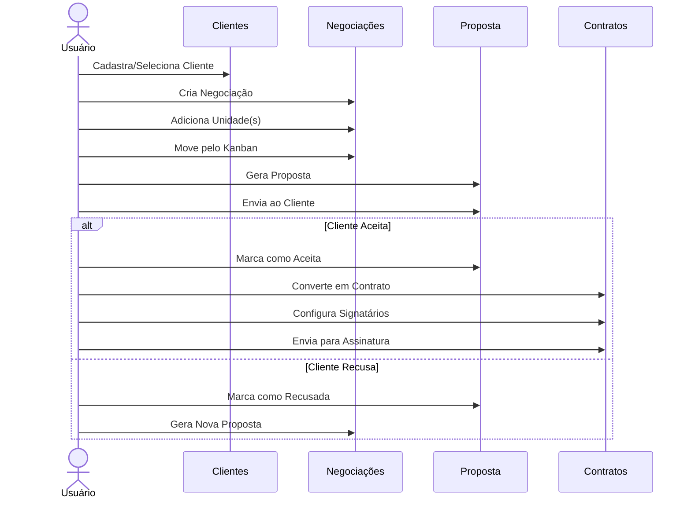

#### Fluxo: Aprovar Contrato

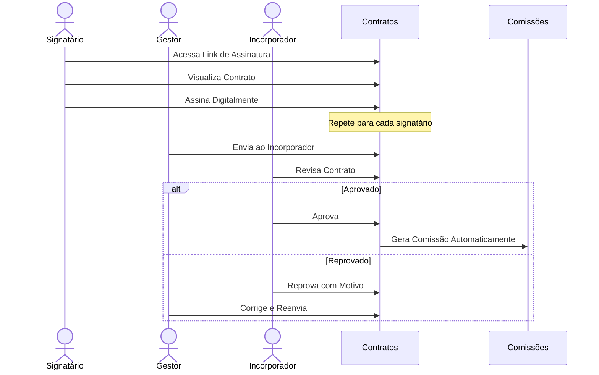

### 6.4 Responsividade

O sistema é totalmente responsivo com adaptações para diferentes dispositivos:

| Breakpoint | Largura | Adaptações |
|------------|---------|------------|
| Mobile | < 768px | Menu colapsado, cards empilhados, tabelas em cards |
| Tablet | 768px - 1024px | Menu lateral compacto, grid 2 colunas |
| Desktop | > 1024px | Layout completo, todas as colunas visíveis |

#### Componentes Responsivos
- **Sidebar**: Drawer em mobile, fixa em desktop
- **Tabelas**: Versão card em mobile com dados essenciais
- **Formulários**: Campos empilhados em mobile
- **Kanban**: Scroll horizontal em mobile
- **Dashboards**: Cards empilhados em mobile

---

## Apêndices

### A. Variáveis de Ambiente

```env
# Supabase
SUPABASE_URL=https://xxxxx.supabase.co
SUPABASE_ANON_KEY=eyJhbGc...
SUPABASE_SERVICE_ROLE_KEY=eyJhbGc... # Apenas para Edge Functions
```

### B. Comandos Úteis

```bash
# Desenvolvimento
npm run dev

# Build
npm run build

# Testes
npm run test

# Deploy Edge Functions
supabase functions deploy <nome-funcao>
```

### C. Estrutura de Tipos

Os tipos principais estão definidos em `src/types/`:

- `auth.types.ts` - Autenticação e autorização
- `clientes.types.ts` - Clientes e leads
- `negociacoes.types.ts` - Negociações e propostas
- `contratos.types.ts` - Contratos e assinaturas
- `comissoes.types.ts` - Comissões e pagamentos
- `empreendimentos.types.ts` - Empreendimentos e unidades
- `marketing.types.ts` - Tickets e briefings
- `financeiro.types.ts` - Lançamentos financeiros
- `funis.types.ts` - Funis e etapas
- `reservas.types.ts` - Reservas de unidades

### D. Convenções de Código

- **Componentes**: PascalCase (`ClienteForm.tsx`)
- **Hooks**: camelCase com prefixo `use` (`useClientes.ts`)
- **Tipos**: PascalCase (`Cliente`, `Negociacao`)
- **Enums**: SCREAMING_SNAKE_CASE (`STATUS_PROPOSTA_LABELS`)
- **Funções**: camelCase (`handleSubmit`, `formatCurrency`)
- **Constantes**: SCREAMING_SNAKE_CASE (`API_URL`)

---

## Changelog

### v1.1 (02/01/2026)

**Novo: Fluxo de Solicitação de Reserva (Gatekeeper)**
- Corretores não reservam unidades diretamente, enviam solicitações
- Gestores aprovam/rejeitam na fila `/solicitacoes`
- Conflitos são detectados e rejeitados automaticamente

**Novos Campos:**
- `negociacoes`: `status_aprovacao`, `solicitada_em`, `aprovada_em`, `rejeitada_em`, `motivo_rejeicao`, `valor_total_fechamento`, `condicao_pagamento`, `indice_correcao`, `created_by`, `updated_by`
- `contrato_signatarios`: `tem_conjuge`, `conjuge_nome`, `conjuge_cpf`, `conjuge_email`, `regime_bens`
- `comissoes`: `estornada`, `data_estorno`, `created_by`, `updated_by`
- `contratos`: `created_by`, `updated_by`

**Novas RPCs:**
- `aprovar_solicitacao_negociacao(negociacao_id, gestor_id)`
- `rejeitar_solicitacao_negociacao(negociacao_id, motivo, gestor_id)`

**Novos Triggers:**
- `trigger_validate_conjuge` - Valida dados do cônjuge
- `trigger_liberar_unidades_cancelamento` - Libera unidades quando aprovação é revertida

**Novas RLS Policies:**
- `Corretores insert pendente only` - Restringe criação de negociações
- `Gestores update aprovacao` - Permite gestores aprovarem
- `Gestores delete itens pendentes` - Permite remover itens de solicitações

**Nova Tela:**
- Solicitações (`/solicitacoes`) - Fila de aprovação para admin/super_admin

**Novos Webhooks:**
- `solicitacao_criada`, `solicitacao_aprovada`, `solicitacao_rejeitada`

**Novos Arquivos:**
- `src/pages/Solicitacoes.tsx`
- `src/hooks/useSolicitacoes.ts`
- `src/components/solicitacoes/*`
- `src/components/mapa/PainelSolicitacao.tsx`

---

*Documentação gerada em Janeiro de 2026*
*Versão do Sistema: 1.1*
